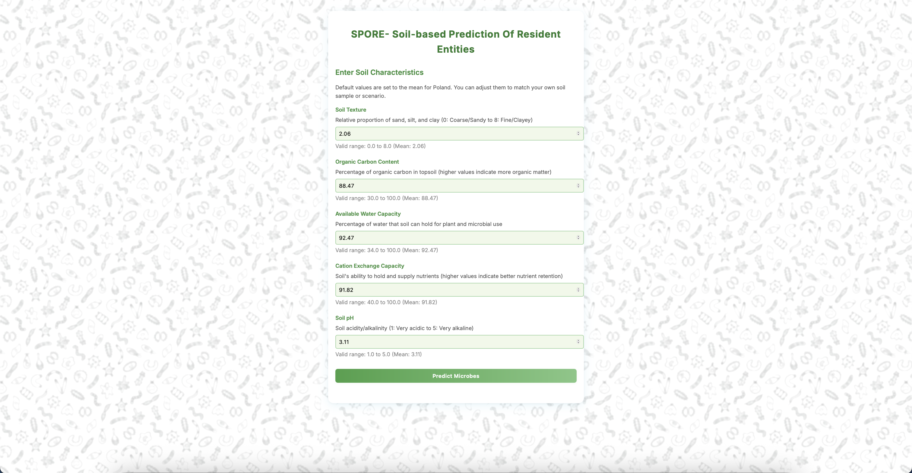

# 🌱 Soil Microbe Predictor - Poland 

This application predicts probable soil microbes based on soil characteristics, specifically for Polish soils. 

## ✨ Features

- Input soil characteristics:
  - **Soil Texture** (0–8): Relative proportion of sand, silt, and clay (0: Coarse/Sandy to 8: Fine/Clayey) 
  - **Organic Carbon Content** (30–100): Percentage of organic carbon in topsoil (higher values indicate more organic matter) 
  - **Available Water Capacity** (34–100): Percentage of water that soil can hold for plant and microbial use 
  - **Cation Exchange Capacity** (40–100): Soil's ability to hold and supply nutrients (higher values indicate better nutrient retention) 
  - **Soil pH** (1–5): Soil acidity/alkalinity (1: Very acidic to 5: Very alkaline) 
    
- Predicts probable soil microbes
  
- Provides explanations for predictions (with Gemini)
  
- Focused on Polish soil conditions 

---

### 🖼️ App Screenshots

**Input Form:**



**Predicted Microbes:**


---

## 🚀 Setup

1. Create a virtual environment:
```bash
python -m venv venv
source venv/bin/activate  # On Windows: venv\Scripts\activate
```

2. Install dependencies:
```bash
pip install -r requirements.txt
```

5. **Download Required Datasets**
   - Download the necessary soil and microbe datasets (e.g., shapefiles, DBF files, CSVs) and place them in the `data/` directory as described above.
   - See the [Data Sources](#-data-sources) section for links and citation information.
   - If you do not have access to these datasets, the app will not function correctly.


3. Run the application:
```bash
python app.py
```

4. Open your browser and navigate to `http://localhost:5000`
   


5. **Download Required Datasets**
   - Download the necessary soil and microbe datasets (e.g., shapefiles, DBF files, CSVs) and place them in the `data/` directory as described above.
   - See the [Data Sources](#-data-sources) section for links and citation information.
   - If you do not have access to these datasets, the app will not function correctly.

## 📚 Data Sources

This app uses:
- **European Soil Database (ESDB):** for soil characteristics and polygons in Poland. 🗺️  
  **Reference:** The European Soil Database distribution version 2.0, European Commission and the European Soil Bureau Network, CD-ROM, EUR 19945 EN, 2004.
- **GBIF (Global Biodiversity Information Facility):** for occurrence data of soil microbes in Poland. See [GBIF](https://www.gbif.org/) for more information. 🌍


<div align="center">
  <strong>Made with ❤️ by Sarvagna</strong>
</div> 
